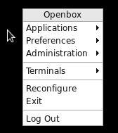

# Basic Apps

## ULauncher

1. Type ***<Alt+Space>*** to launch an application.

1. Launch Chrome.

	1. Type ***<Alt+Space>*** and then type ***Chrome***.

## Openbox

1. Openbox is a minimalist Linux window manager.

1. Move Chrome using keyboard shorcuts.

	1. Find your Super key. The Super key usually looks like the Windows key.

	1. Type ***<Super+Left>***, and then type ***<Super+Right>*** to move an application (i.e. Chrome) to the left or to the right.

	1. Type ***<Super+Up>*** to center an application.

	1. Type ***<Super+M>*** to maximize an application.

	1. Type ***<Super+Down>*** to minimize an application.

	1. Type ***<Super+Tab>*** and find your app to bring it back up.

1. Right click on an empty space to bring up the menu.

	

1. Switch between Chrome and Sublime.

	1. Launch Sublime.

	1. Type ***<Alt+Tab>*** and immediately let go of the keys. Do not hold down on ***<Alt+Tab>***. Use the ***\<Up\>*** and ***\<Down\>*** arrow keys to select either Chrome or Sublime.

	1. Type ***<Alt+Tab>*** again. If you do not wish to choose a window, hit ***\<Escape\>***.

1. Lock and unlock your computer.

	1. The screen will turn black if you type ***<Control+Alt+K>*** to lock your computer. To unlock your computer, start typing your password and then hit ***\<Enter\>***. If you typed your password incorrectly, the screen will turn red. Retype your password and hit ***\<Enter\>*** again. The screen will unlock when you type your password correctly.

	1. Lock your computer. Then, unlock your computer.

1. Take a screenshot.

	1. Type ***<Control+Alt+S>*** to take a screen shot.

	1. Your file will be saved to a file like ***/home/me/Desktop/screenshot-1610537598.png***.

## Websites

1. Login to the following websites. If you have any problems, contact IT. Skip this section.

1. Go to [Google Apps](https://mail.google.com).

1. Go to [JIRA](https://issues.liferay.com).

1. Go to [UltiPro](https://liferay.ultipro.com).

## Apps

1. Launch Bluetooth Manager.

	1. Use Bluetooth Manager to pair with bluetooth devices.

	1. Type ***<Alt+F4>*** to quit.

1. Launch Pinta.

	1. Use Pinta for basic image editing.

	1. Type ***<Control+Q>*** to quit. Some apps will quit with either ***<Alt+F4>*** or ***<Control+Q>***. Some apps will only quit with one of the commands.

1. Launch PulseAudio Volume Control.

	1. Use PulseAudio Volume Control to adjust your audio settings.

	1. Type ***<Control+Q>*** to quit.

1. Launch SimpleScreenRecorder.

	1. Use SimpleScreenRecorder to record your screen.

	1. Type ***<Alt+F4>*** to quit.

1. Launch Slack.

	1. Type ***<Alt+Space>*** and then type ***Slack***.

	1. Login to liferay.slack.com.

	1. Install Slack on your phone. Notice that messages that are sent from your phone and from the Slack app on your computer are synchronized.