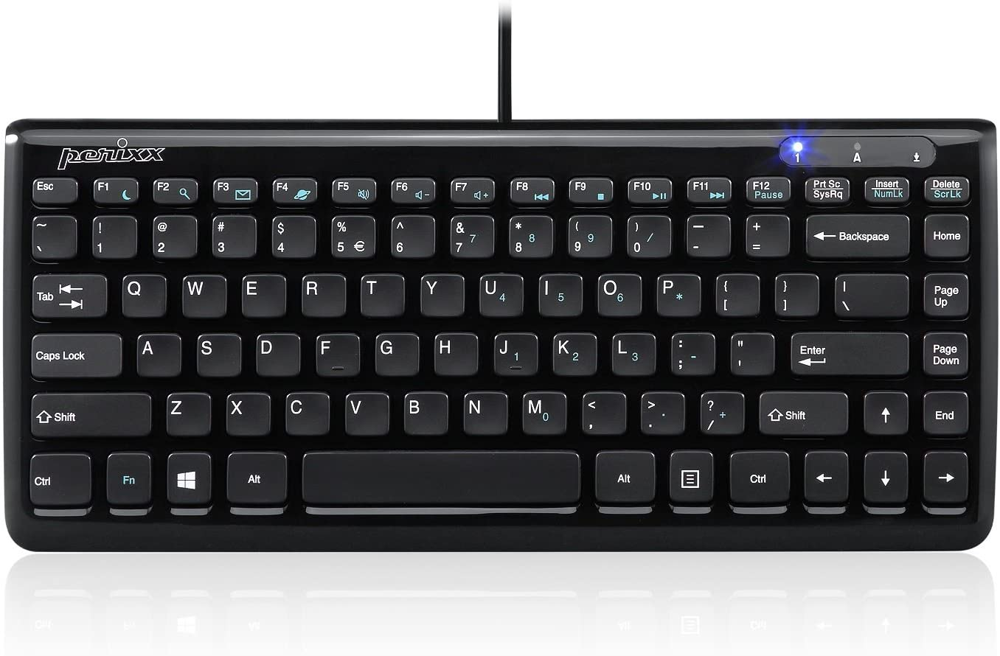
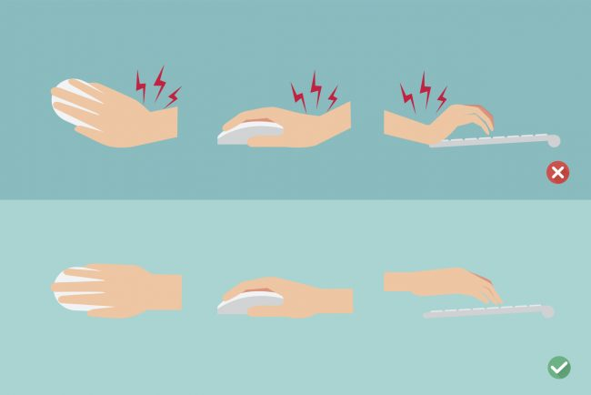
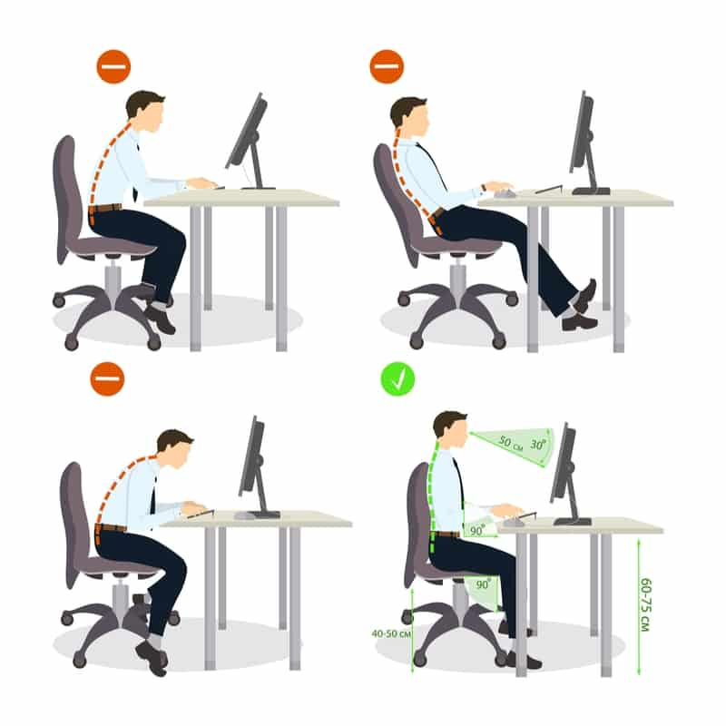

# Posture

## Control and Caps Lock Are Swapped

The Caps Lock is hardly ever used. Control is used extensively for coding.

Swapping Caps Lock and Control allows you to avoid wristlocks and [dor de punho](https://en.wikipedia.org/wiki/Wristlock). You only have 2 hands.

Your ability to work depends on your ability to avoid carpal tunnel.

<!--
https://upload.wikimedia.org/wikipedia/commons/c/c1/FASTPAC_Martial_Arts_04.jpg
https://www.amazon.com/Happy-Hacking-Keyboard-Professional2-White/dp/B000EXZ0V2
-->

## The Recommended Keyboard

The Perixx [PERIBOARD-407B](https://smile.amazon.com/Perixx-PERIBOARD-407B-Mini-Keyboard-Dimension/dp/B0053O9ZNQ) is the recommended keyboard. The location of the keys, with a US layout, is optimal for coding.

## Use a Keyboard and Mouse Properly

<!--
https://www.cmd-ltd.com/advice-centre/ergonomics/why-is-typing-ergonomics-important
-->

## Sit Properly

<!--
https://www.work-fit.com/blog/how-to-sit-properly-at-your-desk
-->

