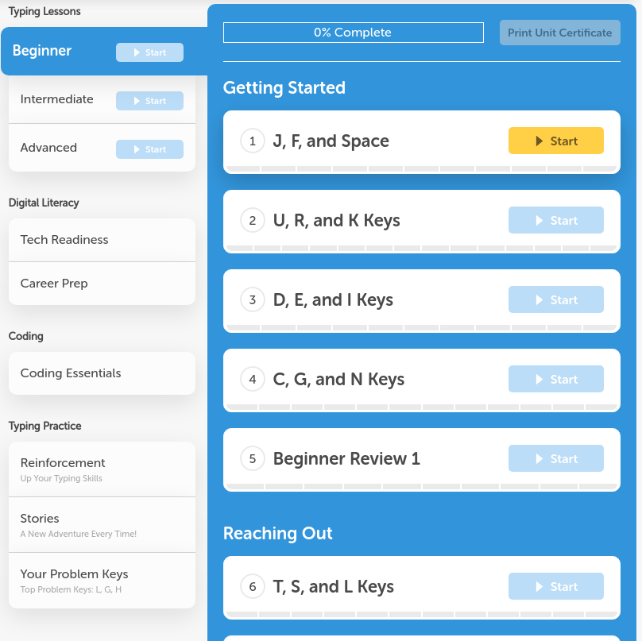
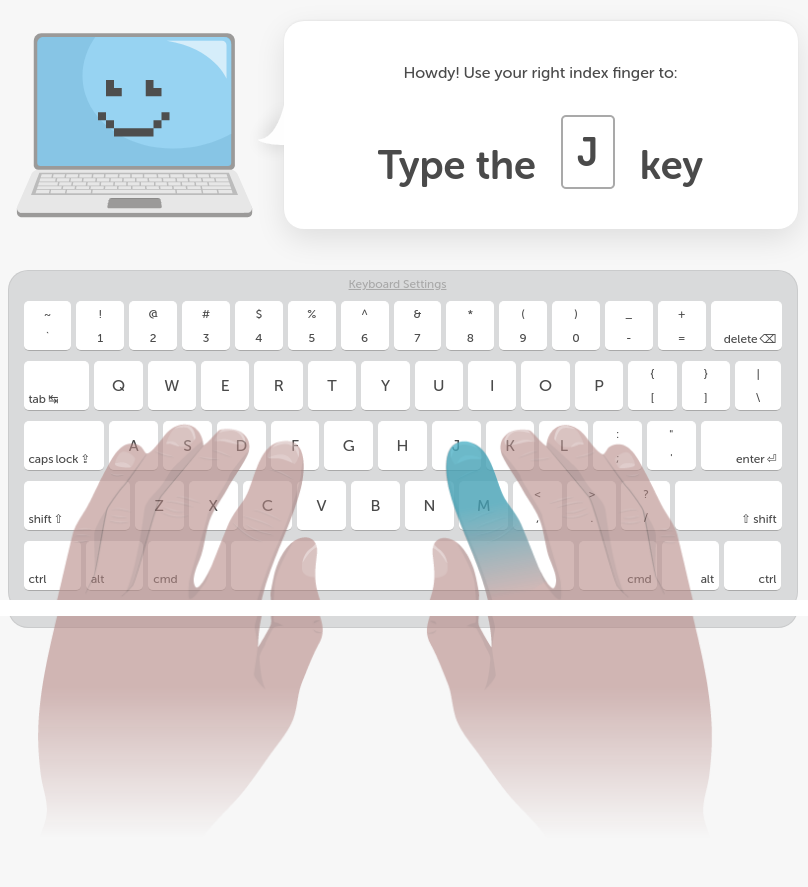

# Typing

## Test Yourself

Go to https://www.typing.com/student/tests. Take the one minute test.

At minimum, a developer must type faster than 70 words per minute. An average developer can type faster than 90 words per minute.

## Learn to Type Faster

Go to https://www.typing.com/student/lessons.

Use the correct fingers! You cannot type fast if you type with the wrong fingers!

Practice 10 minutes a day until you break out of the bad habit of using the wrong fingers.

You must learn to type letters, numbers, and symbols while using all 10 fingers correctly without looking at your keyboard.